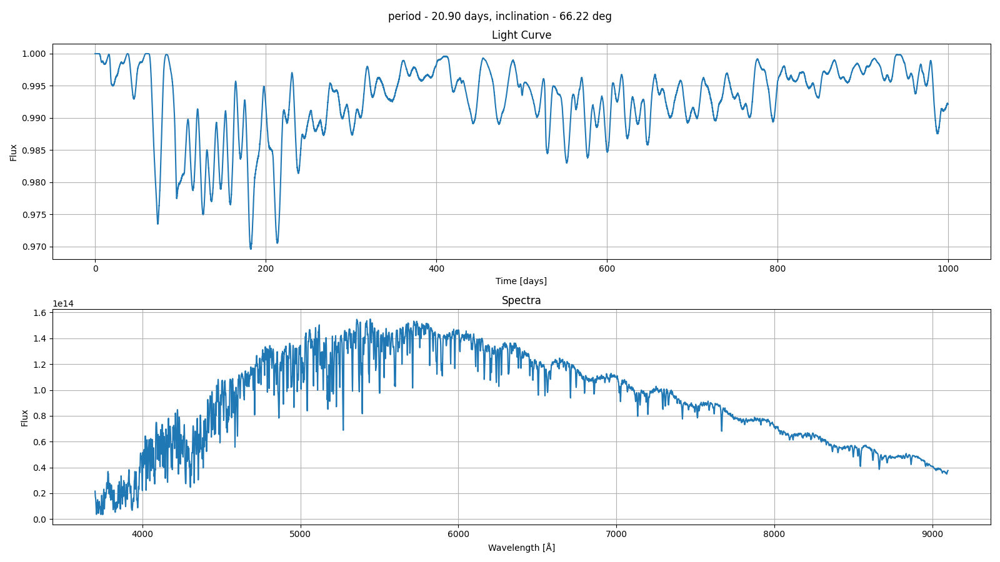

# Dynamo

## Towards realistic stellar obserables



**Dynamo** is a Python package for simulating stellar light curves and spectra, combining detailed models of stellar evolution, surface activity, planetary transits, and noise. It is based on several exisiting open-source projects that were modified and combined to create stronger link between stellar evolution and stellar observables.

## Features

- **Stellar Surface Simulation**: Models the emergence and evolution of star spots and active regions using configurable activity cycles, latitude distributions, and spot evolution laws. This part is based on the [Butterpy](https://github.com/zclaytor/butterpy) package.
- **Grid-based lightcurve and spectra**: Generates synthetic spectra and light curves, including the effects of limb darkening, rotational broadening and spot evolution. This is done in a grid approach and motivated by the [Starsim](https://github.com/dbarochlopez/starsim) package.
- **Stellar Evolution Parameters**: Interpolates stellar parameters (e.g., mass, radius, temperature, luminosity) from evolutionary models. To get stellar evolution parameters we use [kiauhoku](https://github.com/zclaytor/kiauhoku) package. 

Using **Dynamo** we can easily link between stellar evolution parameters (Temperature, mass, logg, etc.) and magnetic-driven spots. Such connection enable the creation of simulated light curve and spectra of the same star, which can serve as a simulated dataset for multi-modal machine learning models for example.

---

## Installation

1. Clone the repository:
   ```bash
   git clone https://github.com/IlayMalinyak/Dynamo.git
   cd Dynamo
   ```

2. Install dependencies:
   ```bash
   pip install -r requirements.txt
   ```

## Usage

### Simulating a Star

You can configure and run a stellar simulation by editing the `starsim.conf` file and using the main classes in the `Dynamo` package. Example:

```python
from Dynamo.star import Star

# Initialize a star from configuration
star = Star(conf_file_path='starsim.conf')

# Set up simulation times and wavelength grid
import numpy as np
times = np.linspace(0, 30, 1000)  # 30 days, 1000 points
wavelengths = np.linspace(4000, 9500, 1000)  # Angstroms

# generate spots map
sm.generate_spot_map(ndays=1000)
# Run the forward simulation
star.compute_forward(t=times, wv_array=wavelengths)

# Access results (e.g., light curve, spectra)
# star.results, star.spot_map, etc.
```

### Example: Generating a Dataset of Light Curves and Spectra

You can generate a full dataset of physically-consistent light curves and spectra using the script `dataset/create_data.py`. This script samples stellar parameters, simulates surface activity, and produces time series and spectra for each synthetic star.
**Note-in dataset/create_data.py we assume some priors that might be non-trivial (for example age-activity and spot-activity relationships). You might want to edit them for your use case**

### Command-Line Usage

```bash
python -m Dynamo.create_data \
    --models_root /path/to/stellar/models \
    --dataset_dir dataset \
    --plot_dir images \
    --plot_every 100 \
    --num_simulations 1000 \
    --ndays 1000 \
    --n_cpu 4
```
this would create 1000 simulations of 1000 days each. The arguments are:

- `--models_root`: Path to the directory containing stellar evolution models.
- `--dataset_dir`: Output directory for the generated dataset (default: `dataset`).
- `--plot_dir`: Directory to save diagnostic plots (default: `images`).
- `--plot_every`: Save a plot every N simulations (default: 100).
- `--num_simulations`: Number of stars (light curves/spectra) to generate (default: 1000).
- `--ndays`: Number of days to simulate for each light curve (default: 1000).
- `--n_cpu`: Number of CPU cores to use for parallel processing (default: 1).

## Configuration

Simulation parameters are controlled via the `starsim.conf` file, which includes sections for:

- Stellar properties (mass, radius, temperature, rotation, etc.)
- Spot and faculae properties (faculea are currently not supported)
- Limb darkening
- Planetary parameters
- Noise characteristics

See the comments in `starsim.conf` for detailed descriptions of each parameter.

## License

This project is licensed under the MIT License. See `LICENSE` for details.

## Acknowledgments

- PHOENIX stellar atmosphere models
- [Butterpy](https://github.com/zclaytor/butterpy)
- [Starsim](https://github.com/dbarochlopez/starsim)
- [kiauhoku](https://github.com/zclaytor/kiauhoku)

---

## Contact
ilay.kamai@campus.technion.ac.il